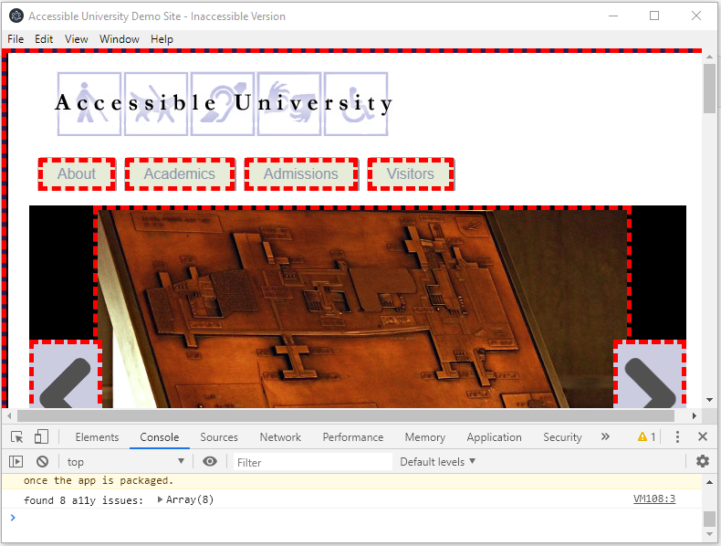

# electron-axe-scanner-poc
A proof-of-concept app for injecting axe and scanning for a11y issue on a web page hosted on an electron BrowserWindow

## dependencies
Make sure you have yarn installed. More info on how to install it [here](https://yarnpkg.com/en/docs/install)

## how to run
**install dependencies**
```bash
yarn install
```
**build the app**
```bash
yarn build
```
**start the app**
```bash
yarn start
```

## how does it looks

[]